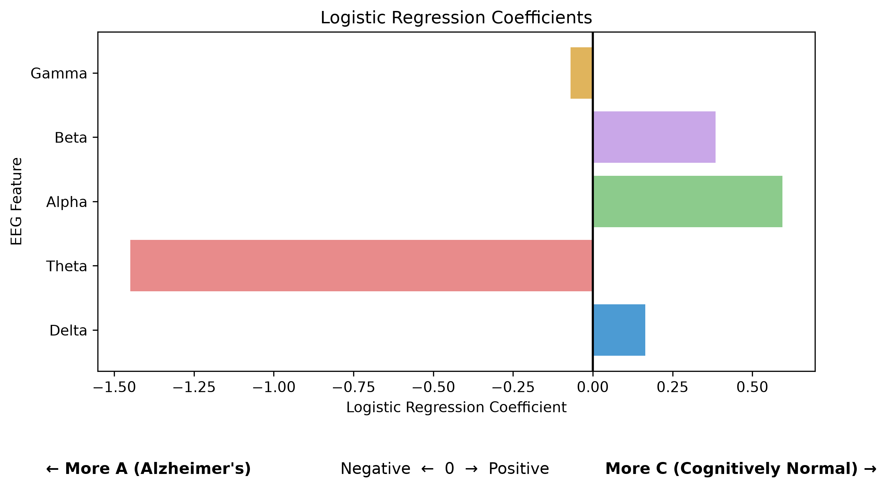
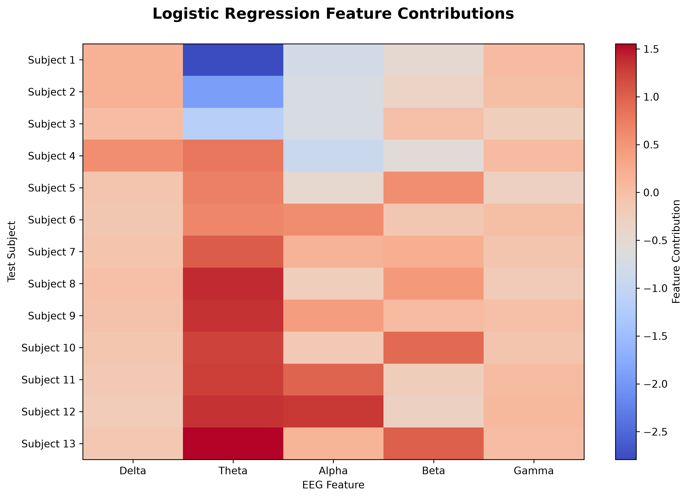
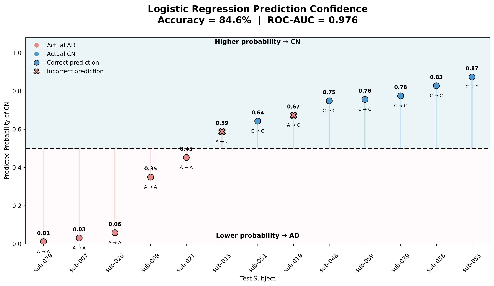

<div align="center">

# 🧠 EEG-Based Alzheimer's Disease Classification

### MNE-Python • Signal Processing • ICA • Spectral Analysis • Machine Learning

An end-to-end EEG analysis pipeline for investigating Alzheimer's disease from resting-state, eyes-closed EEG using reproducible Python workflows.

<br>


<br>

**Pilot analysis completed on `sub-001` · Full-dataset feature extraction completed · Logistic Regression completed**

</div>

---

## 🔬 Project Overview

Alzheimer's disease is associated with alterations in brain activity that can be investigated using electroencephalography (EEG).

This project develops a reproducible computational pipeline for analyzing resting-state, eyes-closed EEG recordings and extracting quantitative spectral features for downstream machine-learning analysis.

The workflow covers the complete analysis path:

**Raw EEG → Quality Inspection → Preprocessing → Artifact Correction → ICA → Spectral Analysis → Epoching → Feature Extraction → Subject-Level Dataset → Machine Learning**

The analysis was first developed and validated on a single pilot participant and was then systematically applied to the complete dataset of 88 participants.

---

## 📊 Dataset

**Dataset:** [OpenNeuro ds004504](https://openneuro.org/datasets/ds004504)

The dataset contains **88 participants**:

| Group | Subjects |
|---|---:|
| Alzheimer's disease (AD) | 36 |
| Frontotemporal dementia (FTD) | 23 |
| Cognitively normal (CN) | 29 |
| **Total** | **88** |

### EEG Recording

- **19 scalp EEG channels**
- **500 Hz** sampling frequency
- Resting-state
- Eyes-closed condition
- Continuous EEG recordings
- 10-20 electrode placement system
- Original recordings stored as EEGLAB `.set` files

The dataset is stored locally and is intentionally **excluded from Git tracking** because of its size.

---

## ⚙️ Analysis Pipeline

### 01. Data Exploration

Initial inspection of:

- Participant demographics
- Diagnostic groups
- EEG recording metadata
- Channel names
- Sampling frequency
- Recording duration
- EEG amplitude
- Channel information
- Electrode montage and spatial positions

### 02. Signal Quality & Preprocessing

The preprocessing workflow includes:

- Raw EEG inspection
- Power-line noise investigation
- 50 Hz notch filtering
- Preparation of data for ICA
- Artifact identification
- ICA-based artifact analysis

### 03. Independent Component Analysis

Independent Component Analysis (ICA) is used to separate statistically independent signal sources from the multichannel EEG recording.

The ICA workflow uses:

- Extended Infomax ICA
- Rank-aware component selection after average referencing
- Reproducible random initialization
- ICLabel-based component classification

ICLabel classifications are used for automated artifact handling. Components classified as `eye blink` with a predicted probability of at least 0.80 are excluded before reconstructing the cleaned EEG signal.

### 04. Epoching

Continuous EEG is segmented into:

**4-second non-overlapping epochs**

This produces shorter, approximately stationary segments suitable for spectral analysis and feature extraction.

### 05. Frequency-Domain Analysis

Power Spectral Density (PSD) is estimated using **Welch's method**.

The analysis focuses on the following frequency bands:

| Band | Frequency Range |
|---|---:|
| Delta | 1–4 Hz |
| Theta | 4–8 Hz |
| Alpha | 8–13 Hz |
| Beta | 13–30 Hz |
| Gamma | 30–45 Hz |

### 06. Relative Power

For each epoch and channel:

<div align="center">

```math
\text{Relative Band Power}
=
\frac{\text{Band Power}}
{\text{Delta + Theta + Alpha + Beta + Gamma Power}}
```

</div>

Relative power provides a normalized representation of the contribution of each frequency band to the overall spectral power.

### 07. Spatial Analysis

Topographic representations are used to visualize the spatial distribution of spectral power across the scalp.

This provides a bridge between:

**numerical EEG features ↔ anatomical electrode distribution**

### 08. Subject-Level Features

The epoch-level spectral features are aggregated across the 19 EEG channels and across epochs to obtain subject-level representations.

The subject-level feature vector contains:

- Delta relative power
- Theta relative power
- Alpha relative power
- Beta relative power
- Gamma relative power

Participant metadata such as:

- Diagnostic group
- Age
- MMSE

are retained alongside the EEG features for downstream statistical analysis and machine learning.

---

## 🧪 Pilot Analysis

The first complete workflow was developed and validated using:

**Participant:** `sub-001`

The completed pilot includes:

✅ Raw EEG inspection  
✅ Channel and montage inspection  
✅ Electrode-position visualization  
✅ PSD analysis  
✅ Power-line noise investigation  
✅ 50 Hz notch filtering  
✅ ICA-based artifact analysis  
✅ ICLabel-based artifact classification  
✅ 4-second non-overlapping epoching  
✅ Welch PSD estimation  
✅ Frequency-band power extraction  
✅ Relative-power calculation  
✅ Scalp topographic visualization  
✅ Subject-level feature construction  

The pilot served as a **method-development and validation stage** before the finalized workflow was applied to all 88 participants.

> **Important:** The pilot is not treated as a final disease-classification result. Its purpose is to establish a reproducible preprocessing and feature-extraction pipeline.

---

## 🚀 All-Subject Feature Extraction

The workflow established during the pilot was successfully automated and applied independently to the **complete dataset of 88 participants**.

### Automated Workflow

For each participant, the pipeline performs:

- EEG loading
- 50 Hz notch filtering
- ICA preparation and Extended Infomax ICA
- ICLabel-based artifact classification
- Automatic exclusion of high-confidence eye-blink components
- ICA-based signal reconstruction
- 4-second non-overlapping epoching
- Welch PSD estimation
- Frequency-band power extraction
- Relative-power calculation
- Averaging across EEG channels
- Averaging across epochs
- Subject-level feature construction

### 📊 Final Feature Dataset

The automated pipeline produced a complete subject-level feature matrix containing:

**88 participants × 9 columns**

with **one row representing one participant**.

The dataset includes:

- Subject ID
- Diagnostic group
- Age
- MMSE
- Delta relative power
- Theta relative power
- Alpha relative power
- Beta relative power
- Gamma relative power

The final feature table is saved locally as:

`data/all_subjects_features.csv`

This dataset serves as the input for the subsequent **machine-learning analyses**.

---

## 🤖 Machine Learning

The complete subject-level feature matrix was used as the input for the machine-learning stage.

The first classification experiment was performed using **Logistic Regression** to distinguish:

**Alzheimer's disease (AD) vs Cognitively Normal (CN)**

Participants diagnosed with Frontotemporal Dementia (FTD) were excluded from this binary classification experiment.

### 🧠 Logistic Regression

Logistic Regression was used as the first machine-learning model because it provides a simple and interpretable baseline for binary classification.

The model was trained using the five subject-level EEG spectral features:

- Delta relative power
- Theta relative power
- Alpha relative power
- Beta relative power
- Gamma relative power

The classification dataset therefore contained:

**65 participants**

| Group | Subjects |
|---|---:|
| Alzheimer's disease (AD) | 36 |
| Cognitively normal (CN) | 29 |
| **Total** | **65** |

### 🔹 Feature Preparation

The five EEG features were standardized using `StandardScaler`.

Standardization transforms each feature so that it is centered around zero and scaled according to its standard deviation.

The data were then divided into:

- **80% training data**
- **20% held-out test data**

Stratified splitting was used so that the class distribution was maintained between the training and test sets.

### 🔹 Model Training

The Logistic Regression model was trained using the standardized training features.

The model learned a set of coefficients describing how each EEG feature contributes to the classification decision.

A coefficient with a positive value contributes toward the **CN** class, while a negative coefficient contributes toward the **AD** class in this experiment.

### 📊 Initial Test-Set Results

The model was evaluated on the held-out test set of **13 participants**.

The initial results were:

| Metric | Result |
|---|---:|
| Test Accuracy | **84.6%** |
| ROC-AUC | **0.976** |

The confusion matrix was:

```text
                 Predicted
                 AD    CN

Actual AD         5     2
Actual CN         0     6
```

This corresponds to:

- **5 AD participants** correctly classified as AD
- **2 AD participants** classified as CN
- **6 CN participants** correctly classified as CN
- **0 CN participants** classified as AD

### 📈 Classification Metrics

The classification report for the held-out test set was:

| Class | Precision | Recall | F1-score | Support |
|---|---:|---:|---:|---:|
| AD | 1.00 | 0.71 | 0.83 | 7 |
| CN | 0.75 | 1.00 | 0.86 | 6 |

Overall test accuracy was **84.6%**.

Precision describes how often predictions of a class were correct, while recall describes how many participants belonging to that actual class were correctly identified.

### 📊 ROC-AUC

The Logistic Regression model produced an initial **ROC-AUC of 0.976** on the held-out test set.

The ROC curve evaluates model performance across different probability thresholds by comparing:

- **True Positive Rate (TPR)**
- **False Positive Rate (FPR)**

The AUC summarizes the area under this curve.

For this analysis, the probability of the **CN** class was used to construct the ROC curve.

### 🔄 Cross-Validation

A 5-fold stratified cross-validation experiment was also performed.

The initial cross-validation accuracy scores were:

```text
0.923
0.769
0.692
0.846
0.615
```

The resulting mean and standard deviation were:

**Mean accuracy: 76.9%**

**Standard deviation: 10.9%**

These results show variability between folds, which is important given the relatively small number of participants.

> **Methodological note:** This initial cross-validation experiment was performed on the complete 65-participant AD/CN dataset and therefore included the subjects from the initial held-out test set. Consequently, these cross-validation results are treated as exploratory rather than as the final independent validation estimate. The final model-comparison stage will use cross-validation only within the training set while keeping the test set untouched.

### 🧮 Logistic Regression Coefficients

The learned coefficients were:

| EEG Feature | Coefficient |
|---|---:|
| Delta | 0.164 |
| Theta | -1.450 |
| Alpha | 0.594 |
| Beta | 0.384 |
| Gamma | -0.070 |

Because the features were standardized before model fitting, the coefficient magnitudes can be compared within this model to examine their relative contribution to the classification decision.

The coefficients describe model behavior and should not be interpreted as evidence of a causal biological relationship.

### 🎯 Model Visualizations

The Logistic Regression analysis includes several visualizations:

**ROC Curve**

Displays the relationship between true-positive rate and false-positive rate across probability thresholds.

**Confusion Matrix**

Displays the correct and incorrect predictions for AD and CN.

**Logistic Regression Coefficients**

Shows the direction and magnitude of the learned coefficients for the five EEG features.

**Prediction Confidence**

Provides a subject-level view containing the actual class, predicted class, probability, decision threshold, and correct versus incorrect prediction.

**Feature-Contribution Heatmap**

Visualizes the local contribution of each standardized EEG feature to the Logistic Regression decision for individual test participants.

### 📊 Relative EEG Power Distribution

The distribution of the five relative EEG spectral-power features was visualized separately for Alzheimer's disease (AD) and cognitively normal (CN) participants.

The boxplots summarize the distribution of each frequency band, while the individual points represent the values of individual participants and the open circles indicate the group means.

This visualization provides an exploratory comparison of the EEG feature distributions between the two groups and helps illustrate the characteristics of the features subsequently used as inputs to the Logistic Regression model.

### 📁 Saved Logistic Regression Figures

The Logistic Regression figures are organized under:

`figures/logistic_regression/`

### 🎯 Logistic Coefficients

Shows the direction and relative magnitude of each EEG feature's contribution to the model's classification decision.

<p align="center">
  
</p>

### 🧬 Feature-Contribution Heatmap

Visualizes the local contribution of each standardized EEG feature to the Logistic Regression decision for individual test participants.

<p align="center">
  
</p>

### 🔎 Prediction Confidence

Provides a detailed subject-level visualization showing the actual class, predicted class, probability, decision threshold, and correct versus incorrect predictions.

<p align="center">
  
</p>

### 🔒 Data Leakage Considerations

A major consideration in EEG machine learning is that multiple epochs can originate from the same participant.

Therefore, epochs from one participant must never be randomly distributed between training and test sets.

The final evaluation workflow will maintain **subject-level separation**, ensuring that information from a participant used for model training does not appear in the independent test set.

Future model experiments will use the same subject-level split and evaluation framework for fair comparison between models.

### 🔜 Next Models

The next classification experiments will evaluate:

- **Support Vector Machine (SVM)**
- **Random Forest**

These models will be developed in separate notebooks and evaluated using the same subject-level EEG feature dataset and consistent evaluation framework.

---

## 🧬 Scientific Rationale

EEG-based neurodegenerative disease research often investigates changes in spectral organization and large-scale brain activity.

This project therefore focuses initially on relative spectral power across conventional EEG frequency bands.

Particular attention is given to the distribution of:

**Delta → Theta → Alpha → Beta → Gamma**

rather than relying only on raw amplitude values.

The resulting features can then be investigated statistically and used as inputs for machine-learning models.

---

## 🛠️ Technology Stack

| Tool | Purpose |
|---|---|
| **Python** | Core programming language |
| **MNE-Python** | EEG loading, preprocessing and analysis |
| **NumPy** | Numerical computation |
| **SciPy** | Scientific and signal-processing operations |
| **Pandas** | Metadata and feature-table handling |
| **Matplotlib** | Visualization |
| **Scikit-learn** | Machine learning and evaluation |
| **MNE-ICALabel** | ICA component classification |
| **Jupyter Notebook** | Interactive analysis |
| **Git / GitHub** | Version control and reproducibility |

---

## 📁 Repository Structure

```text
alzheimers-eeg-ml/
│
├── data/                                       # Local EEG dataset & feature tables (Git ignored)
│
├── figures/
│   └── logistic_regression/
│       ├── feature_contributions.png
│       ├── logistic_coefficients.png
│       └── prediction_confience.png
│
├── notebooks/
│   ├── 01_pilot_analysis.ipynb                 # Complete pilot workflow
│   ├── 02_all_subjects_features.ipynb          # Automated feature extraction
│   └── 03_logistic_regression.ipynb            # AD vs CN Logistic Regression
│   
├── .gitignore
│
└── README.md
```