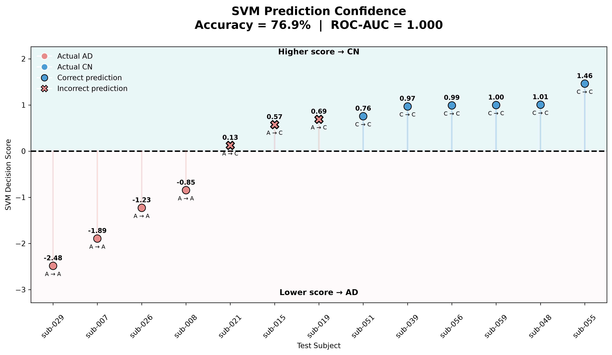
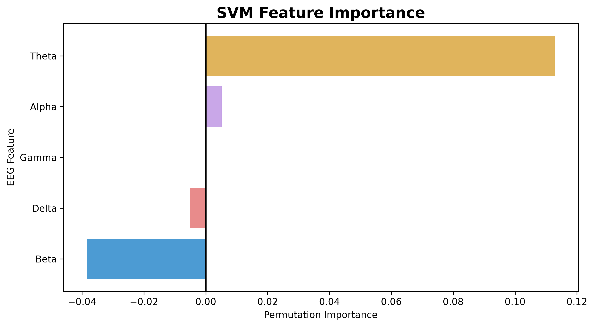
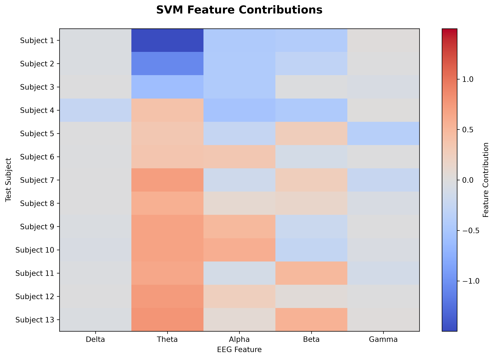
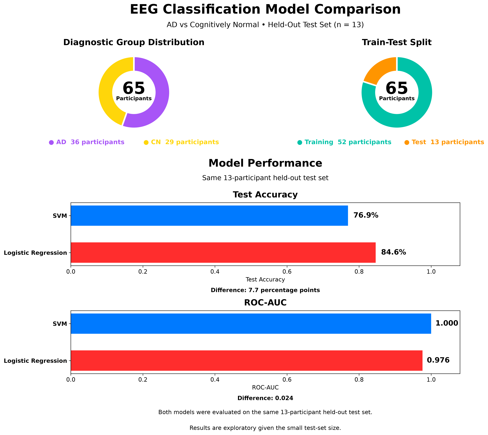

<div align="center">

# 🧠 EEG-Based Alzheimer's Disease Classification

### MNE-Python • Signal Processing • ICA • Spectral Analysis • Machine Learning

An end-to-end EEG analysis pipeline for investigating Alzheimer's disease from resting-state, eyes-closed EEG using reproducible Python workflows.

<br>


<br>

**Pilot analysis completed on `sub-001` · Full-dataset feature extraction completed · Logistic Regression completed · SVM completed**

</div>

---

## 🔬 Project Overview

Alzheimer's disease is associated with alterations in brain activity that can be investigated using electroencephalography (EEG).

This project develops a reproducible computational pipeline for analyzing resting-state, eyes-closed EEG recordings and extracting quantitative spectral features for downstream machine-learning analysis.

The workflow covers the complete analysis path:

**Raw EEG → Quality Inspection → Preprocessing → Artifact Correction → ICA → Spectral Analysis → Epoching → Feature Extraction → Subject-Level Dataset → Machine Learning**

The analysis was first developed and validated on a single pilot participant and was then systematically applied to the complete dataset of 88 participants.

---

## 📊 Dataset

**Dataset:** [OpenNeuro ds004504](https://openneuro.org/datasets/ds004504)

The dataset contains **88 participants**:

| Group | Subjects |
|---|---:|
| Alzheimer's disease (AD) | 36 |
| Frontotemporal dementia (FTD) | 23 |
| Cognitively normal (CN) | 29 |
| **Total** | **88** |

### EEG Recording

- **19 scalp EEG channels**
- **500 Hz** sampling frequency
- Resting-state
- Eyes-closed condition
- Continuous EEG recordings
- 10-20 electrode placement system
- Original recordings stored as EEGLAB `.set` files

The dataset is stored locally and is intentionally **excluded from Git tracking** because of its size.

---

## ⚙️ Analysis Pipeline

### 01. Data Exploration

Initial inspection of:

- Participant demographics
- Diagnostic groups
- EEG recording metadata
- Channel names
- Sampling frequency
- Recording duration
- EEG amplitude
- Channel information
- Electrode montage and spatial positions

### 02. Signal Quality & Preprocessing

The preprocessing workflow includes:

- Raw EEG inspection
- Power-line noise investigation
- 50 Hz notch filtering
- Preparation of data for ICA
- Artifact identification
- ICA-based artifact analysis

### 03. Independent Component Analysis

Independent Component Analysis (ICA) is used to separate statistically independent signal sources from the multichannel EEG recording.

The ICA workflow uses:

- Extended Infomax ICA
- Rank-aware component selection after average referencing
- Reproducible random initialization
- ICLabel-based component classification

ICLabel classifications are used for automated artifact handling. Components classified as `eye blink` with a predicted probability of at least 0.80 are excluded before reconstructing the cleaned EEG signal.

### 04. Epoching

Continuous EEG is segmented into:

**4-second non-overlapping epochs**

This produces shorter, approximately stationary segments suitable for spectral analysis and feature extraction.

### 05. Frequency-Domain Analysis

Power Spectral Density (PSD) is estimated using **Welch's method**.

The analysis focuses on the following frequency bands:

| Band | Frequency Range |
|---|---:|
| Delta | 1–4 Hz |
| Theta | 4–8 Hz |
| Alpha | 8–13 Hz |
| Beta | 13–30 Hz |
| Gamma | 30–45 Hz |

### 06. Relative Power

For each epoch and channel:

<div align="center">

```math
\text{Relative Band Power}
=
\frac{\text{Band Power}}
{\text{Delta + Theta + Alpha + Beta + Gamma Power}}
```

</div>

Relative power provides a normalized representation of the contribution of each frequency band to the overall spectral power.

### 07. Spatial Analysis

Topographic representations are used to visualize the spatial distribution of spectral power across the scalp.

This provides a bridge between:

**numerical EEG features ↔ anatomical electrode distribution**

### 08. Subject-Level Features

The epoch-level spectral features are aggregated across the 19 EEG channels and across epochs to obtain subject-level representations.

The subject-level feature vector contains:

- Delta relative power
- Theta relative power
- Alpha relative power
- Beta relative power
- Gamma relative power

Participant metadata such as:

- Diagnostic group
- Age
- MMSE

are retained alongside the EEG features for downstream statistical analysis and machine learning.

---

## 🧪 Pilot Analysis

The first complete workflow was developed and validated using:

**Participant:** `sub-001`

The completed pilot includes:

✅ Raw EEG inspection  
✅ Channel and montage inspection  
✅ Electrode-position visualization  
✅ PSD analysis  
✅ Power-line noise investigation  
✅ 50 Hz notch filtering  
✅ ICA-based artifact analysis  
✅ ICLabel-based artifact classification  
✅ 4-second non-overlapping epoching  
✅ Welch PSD estimation  
✅ Frequency-band power extraction  
✅ Relative-power calculation  
✅ Scalp topographic visualization  
✅ Subject-level feature construction  

The pilot served as a **method-development and validation stage** before the finalized workflow was applied to all 88 participants.

> **Important:** The pilot is not treated as a final disease-classification result. Its purpose is to establish a reproducible preprocessing and feature-extraction pipeline.

---

## 🚀 All-Subject Feature Extraction

The workflow established during the pilot was successfully automated and applied independently to the **complete dataset of 88 participants**.

### Automated Workflow

For each participant, the pipeline performs:

- EEG loading
- 50 Hz notch filtering
- ICA preparation and Extended Infomax ICA
- ICLabel-based artifact classification
- Automatic exclusion of high-confidence eye-blink components
- ICA-based signal reconstruction
- 4-second non-overlapping epoching
- Welch PSD estimation
- Frequency-band power extraction
- Relative-power calculation
- Averaging across EEG channels
- Averaging across epochs
- Subject-level feature construction

### 📊 Final Feature Dataset

The automated pipeline produced a complete subject-level feature matrix containing:

**88 participants × 9 columns**

with **one row representing one participant**.

The dataset includes:

- Subject ID
- Diagnostic group
- Age
- MMSE
- Delta relative power
- Theta relative power
- Alpha relative power
- Beta relative power
- Gamma relative power

The final feature table is saved locally as:

`data/all_subjects_features.csv`

This dataset serves as the input for the subsequent **machine-learning analyses**.

---

## 🤖 Machine Learning

The complete subject-level feature matrix was used as the input for the machine-learning stage.

The classification experiments focus on:

**Alzheimer's disease (AD) vs Cognitively Normal (CN)**

Participants diagnosed with Frontotemporal Dementia (FTD) were excluded from these binary classification experiments.

### 🧠 Classification Dataset

The machine-learning dataset contained:

**65 participants**

| Group | Subjects |
|---|---:|
| Alzheimer's disease (AD) | 36 |
| Cognitively normal (CN) | 29 |
| **Total** | **65** |

Each participant was represented using five subject-level EEG spectral features:

- Delta relative power
- Theta relative power
- Alpha relative power
- Beta relative power
- Gamma relative power

### 🔹 Train-Test Strategy

The 65 participants were divided using a stratified 80/20 train-test split:

- **52 participants** for training
- **13 participants** for the held-out test set

The same train-test split was used for the Logistic Regression and SVM experiments.

The final 13-participant test set was kept separate during model selection and hyperparameter tuning.

---

## 🧮 Logistic Regression

Logistic Regression was used as the first classification model and provides an interpretable linear baseline for binary classification.

### Model Preparation

The five EEG features were standardized using `StandardScaler`.

The standardized features were used to train a Logistic Regression classifier on the 52 training participants.

The model learned coefficients describing the direction and relative magnitude of each feature's contribution to the classification decision.

### Initial Test-Set Results

The Logistic Regression model was evaluated on the held-out test set of 13 participants.

| Metric | Result |
|---|---:|
| Test Accuracy | **84.6%** |
| ROC-AUC | **0.976** |

The confusion matrix was:

```text
                 Predicted
                 AD    CN

Actual AD         5     2
Actual CN         0     6
```

This corresponds to:

- **5 AD participants** correctly classified as AD
- **2 AD participants** classified as CN
- **6 CN participants** correctly classified as CN
- **0 CN participants** classified as AD

### Cross-Validation

An initial 5-fold stratified cross-validation experiment was performed on the complete 65-participant AD/CN dataset.

The fold accuracies were:

```text
0.923
0.769
0.692
0.846
0.615
```

The mean accuracy was:

**76.9%**

The standard deviation was:

**10.9%**

> **Methodological note:** This initial Logistic Regression cross-validation experiment included the subjects from the held-out test set because cross-validation was performed on all 65 participants. Therefore, these cross-validation results are treated as exploratory rather than as a final independent validation estimate. The SVM experiment subsequently used cross-validation only within the 52 training participants.

### 🧮 Logistic Regression Coefficients

The learned coefficients were:

| EEG Feature | Coefficient |
|---|---:|
| Delta | 0.164 |
| Theta | -1.450 |
| Alpha | 0.594 |
| Beta | 0.384 |
| Gamma | -0.070 |

Because the features were standardized before model fitting, the coefficient magnitudes can be compared within this model to examine their relative contribution to the classification decision.

The coefficients describe model behavior and should not be interpreted as evidence of a causal biological relationship.

---

## ⚙️ Support Vector Machine

The second classification experiment used a **Support Vector Machine (SVM)** with an RBF kernel.

The RBF kernel allows the SVM to model nonlinear decision boundaries.

### Initial SVM Configuration

The initial SVM used:

```python
SVC()
```

with the default configuration:

- **Kernel:** RBF
- **C:** 1.0
- **Gamma:** `scale`

### Initial Test-Set Results

The initial SVM was evaluated on the same held-out test set of 13 participants.

**Test accuracy: 76.9%**

The confusion matrix was:

```text
                 Predicted
                 AD    CN

Actual AD         4     3
Actual CN         0     6
```

This corresponds to:

- **4 AD participants** correctly classified as AD
- **3 AD participants** classified as CN
- **6 CN participants** correctly classified as CN
- **0 CN participants** classified as AD

The initial ROC-AUC was:

**0.952**

### Initial Classification Metrics

The initial SVM classification report was:

| Class | Precision | Recall | F1-score | Support |
|---|---:|---:|---:|---:|
| AD | 1.00 | 0.57 | 0.73 | 7 |
| CN | 0.67 | 1.00 | 0.80 | 6 |

Overall accuracy was:

**76.9%**

### Cross-Validation and Hyperparameter Tuning

For the SVM, 5-fold stratified cross-validation was performed **only on the 52 training participants**.

The initial SVM cross-validation scores were:

```text
0.636
0.727
0.800
0.800
0.900
```

The mean cross-validation accuracy was:

**77.3%**

The standard deviation was:

**8.8%**

`GridSearchCV` was then used to evaluate:

- `C`: 0.1, 1, 10, 100
- `gamma`: `scale`, 0.01, 0.1, 1

This produced **16 parameter combinations**, each evaluated using 5-fold stratified cross-validation on the 52 training participants.

### Best Parameters

The selected parameters were:

```text
C = 10
gamma = 0.01
```

Best mean cross-validation accuracy:

**81.1%**

Standard deviation for the selected parameter combination:

**7.7%**

### Tuned SVM Test Results

The tuned SVM was evaluated on the same untouched 13-participant test set.

| Metric | Result |
|---|---:|
| Test Accuracy | **76.9%** |
| ROC-AUC | **1.000** |

The tuned model produced the same class predictions as the initial SVM on the held-out test set.

Therefore:

**10 of 13 test participants were correctly classified.**

> **Important:** The tuned SVM ROC-AUC of 1.000 is based on the ranking of decision scores for this particular 13-participant test set. Given the small test-set size, it should not be interpreted as evidence of perfect generalization.

---

## 📊 Model Visualizations

The Logistic Regression and SVM analyses include corresponding visualizations that allow the two models to be viewed side by side.

### 🔎 Prediction Confidence

<table>
<tr>
<td align="center"><strong>Logistic Regression</strong></td>
<td align="center"><strong>SVM</strong></td>
</tr>
<tr>
<td align="center">

</td>
<td align="center">

</td>
</tr>
</table>

The Logistic Regression visualization shows predicted class probabilities, while the SVM visualization shows decision scores relative to the SVM decision boundary.

### 🧬 Model Feature Interpretation

<table>
<tr>
<td align="center"><strong>Logistic Regression Coefficients</strong></td>
<td align="center"><strong>SVM Feature Importance</strong></td>
</tr>
<tr>
<td align="center">

</td>
<td align="center">

</td>
</tr>
</table>

The Logistic Regression plot shows the direction and relative magnitude of the learned coefficients.

The SVM plot uses permutation importance, showing how much model accuracy changes when an EEG feature is randomly shuffled.

These visualizations describe different model properties and should not be interpreted as directly equivalent quantities.

### 🧠 Feature Contributions

<table>
<tr>
<td align="center"><strong>Logistic Regression</strong></td>
<td align="center"><strong>SVM</strong></td>
</tr>
<tr>
<td align="center">

</td>
<td align="center">

</td>
</tr>
</table>

The Logistic Regression heatmap visualizes the local contribution of standardized EEG features to the linear model decision.

The SVM heatmap visualizes the change in SVM decision score when individual test-set features are replaced by their corresponding training-set means.

Because the SVM uses an RBF kernel, these values should not be interpreted as Logistic Regression-style coefficients.

---

## 📈 Logistic Regression vs SVM

A dedicated comparison visualization was created using the saved results from both models.

The comparison shows:

- Test Accuracy
- ROC-AUC

Both models were evaluated on the **same 13-participant held-out test set**.

<p align="center">
  
</p>

The comparison visualization presents the recorded test-set results side by side. It does not account for the difference in cross-validation protocols between the initial Logistic Regression analysis and the corrected SVM analysis.

---

## 🔒 Data Leakage Considerations

A major consideration in EEG machine learning is that multiple epochs can originate from the same participant.

Therefore, subject-level separation is maintained throughout the machine-learning workflow.

For both models, the final model fits used the **52 training participants**, while the **13-participant test set** was reserved for final held-out evaluation.

The initial Logistic Regression cross-validation experiment was performed separately on all 65 participants and therefore included the held-out test subjects. This result is treated as exploratory and is not considered an independent validation estimate.

For SVM hyperparameter tuning, cross-validation was performed only within the **52 training participants**, with scaling included inside the pipeline so that scaling parameters were learned independently within each training fold.

Future model experiments will follow the corrected approach of performing cross-validation and model selection only within the training set.

---

## 🔜 Next Model

The next classification experiment will evaluate a **Random Forest** classifier using the same subject-level EEG feature dataset and a consistent evaluation framework.

---

## 🧬 Scientific Rationale

EEG-based neurodegenerative disease research often investigates changes in spectral organization and large-scale brain activity.

This project therefore focuses initially on relative spectral power across conventional EEG frequency bands.

Particular attention is given to the distribution of:

**Delta → Theta → Alpha → Beta → Gamma**

rather than relying only on raw amplitude values.

The resulting features can then be investigated statistically and used as inputs for machine-learning models.

---

## 🛠️ Technology Stack

| Tool | Purpose |
|---|---|
| **Python** | Core programming language |
| **MNE-Python** | EEG loading, preprocessing and analysis |
| **NumPy** | Numerical computation |
| **SciPy** | Scientific and signal-processing operations |
| **Pandas** | Metadata and feature-table handling |
| **Matplotlib** | Visualization |
| **Scikit-learn** | Machine learning and evaluation |
| **MNE-ICALabel** | ICA component classification |
| **Jupyter Notebook** | Interactive analysis |
| **Git / GitHub** | Version control and reproducibility |

---

## 📚 References

- OpenNeuro Dataset: [ds004504](https://openneuro.org/datasets/ds004504)
- Dataset publication: [A Dataset of EEG Recordings for Alzheimer's Disease, Frontotemporal Dementia and Healthy Controls](https://doi.org/10.3390/data8060095)
- [MNE-Python](https://mne.tools/)
- [Scikit-learn](https://scikit-learn.org/)
- [MNE-ICALabel](https://mne.tools/mne-icalabel/)

---

## 📁 Repository Structure

```text
alzheimers-eeg-ml/
│
├── data/                                               # Local EEG dataset & features table (Git ignored)
│
├── figures/
│   ├── logistic_regression/
│   │   ├── feature_contributions.png
│   │   ├── logistic_coefficients.png
│   │   └── prediction_confidence.png
│   │
│   ├── svm/
│   │   ├── feature_contributions.png
│   │   ├── feature_importance.png
│   │   └── prediction_confidence.png
│   │
│   └── model_comparison/
│       └── logistic_regression_vs_svm.png
│
├── notebooks/
│   ├── 01_pilot_analysis.ipynb                         # Complete pilot workflow
│   ├── 02_all_subjects_features.ipynb                  # Automated feature extraction
│   ├── 03_machine_learning_logistic_regression.ipynb   # AD vs CN Logistic Regression
│   └── 04_machine_learning_svm.ipynb                   # AD vs CN Support Vector Machine
│ 
├── .gitignore
│
└── README.md
```